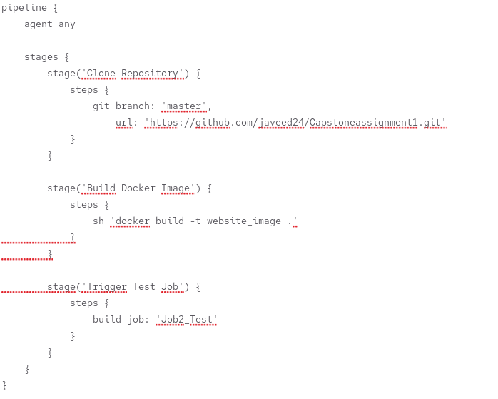
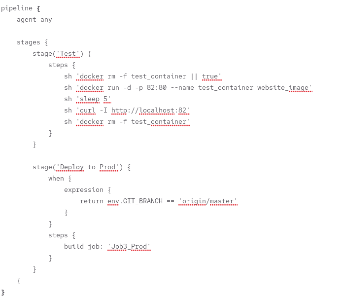
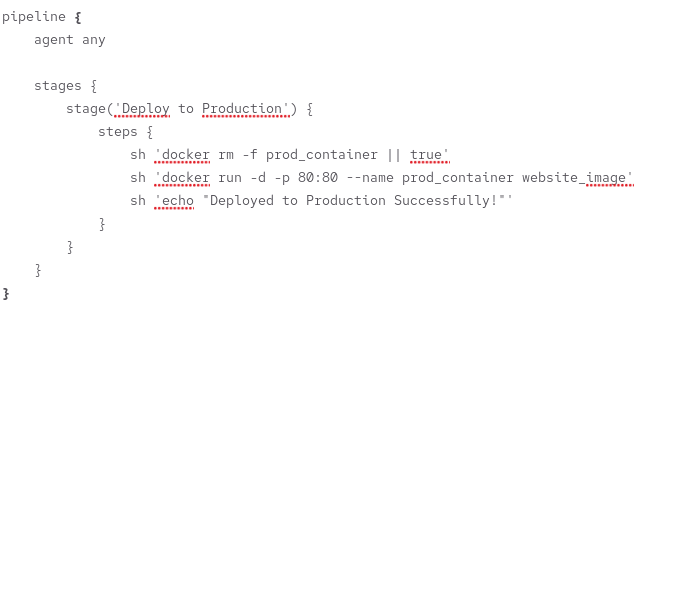
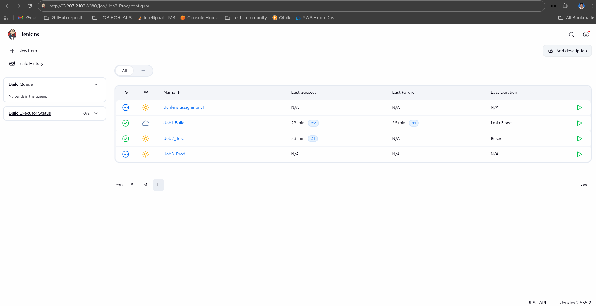

# DevOps Lifecycle Implementation with Jenkins Pipeline & Docker

## Problem Statement
You have been hired as a Sr. DevOps Engineer at Abode Software to implement a complete DevOps lifecycle as fast as possible. Abode Software is a product-based company and their product is available at: https://github.com/hshar/website.git

---

## Architecture Overview

```
GitHub (master/develop)
        ↓
   Jenkins Pipeline
        ↓
  Docker Build (Dockerfile)
        ↓
Job1: Build → Job2: Test → Job3: Prod (master only)
```

---

## Tools & Technologies Used

- **GitHub** – Source control & Git workflow
- **Ansible** – Configuration management
- **Jenkins** – CI/CD pipeline automation
- **Docker** – Containerization
- **hshar/webapp** – Base Docker image

---

## 1. Configuration Management (Ansible)

Ansible is used to install and configure all required software across machines automatically.

### Ansible Playbook

```yaml
---
- hosts: all
  become: yes
  tasks:

    - name: Install Git
      apt:
        name: git
        state: present

    - name: Install Docker
      apt:
        name: docker.io
        state: present

    - name: Start Docker service
      service:
        name: docker
        state: started
        enabled: yes

    - name: Install Java
      apt:
        name: openjdk-11-jdk
        state: present

    - name: Add Jenkins repository key
      apt_key:
        url: https://pkg.jenkins.io/debian/jenkins.io.key
        state: present

    - name: Add Jenkins repository
      apt_repository:
        repo: deb https://pkg.jenkins.io/debian binary/
        state: present

    - name: Install Jenkins
      apt:
        name: jenkins
        state: present
        update_cache: yes

    - name: Start Jenkins service
      service:
        name: jenkins
        state: started
        enabled: yes
```

---

## 2. Git Workflow

| Branch | Purpose |
|--------|---------|
| `master` | Production-ready code only |
| `develop` | Active development & testing |
| `feature/*` | Individual feature branches |

### Workflow
```
feature-branch
      ↓  (pull request)
  develop branch
      ↓  (pull request after testing)
  master branch
```

- All new features are developed in feature branches
- Feature branches are merged into `develop` first
- Only tested and approved code is merged into `master`
- Jenkins webhook triggers automatically on every commit to `master` or `develop`

---

## 3. Dockerfile

The application is containerized using the `hshar/webapp` base image. The code resides in `/var/www/html`.

```dockerfile
FROM hshar/webapp
COPY . /var/www/html
```

- Docker image is built automatically on every GitHub push
- The Dockerfile sits at the root of the repository

---

## 4. Jenkins Pipeline

### Branch-Based Trigger Rules

| Branch | Job1: Build | Job2: Test | Job3: Prod |
|--------|:-----------:|:----------:|:----------:|
| `master` | ✅ | ✅ | ✅ |
| `develop` | ✅ | ✅ | ❌ |

### Jenkinsfile

```groovy
pipeline {
    agent any

    stages {

        stage('Job1 - Build') {
            steps {
                echo 'Cloning repository and building Docker image...'
                git 'https://github.com/hshar/website.git'
                sh 'docker build -t abode-app .'
            }
        }

        stage('Job2 - Test') {
            steps {
                echo 'Running test container...'
                sh 'docker run -d -p 8081:80 --name test-container abode-app'
                sh 'sleep 5'
                sh 'curl -f http://localhost:8081 || exit 1'
                sh 'docker stop test-container'
                sh 'docker rm test-container'
                echo 'Tests passed successfully!'
            }
        }

        stage('Job3 - Prod') {
            when {
                branch 'master'
            }
            steps {
                echo 'Deploying to Production...'
                sh 'docker rm -f prod-container || true'
                sh 'docker run -d -p 80:80 --name prod-container abode-app'
                echo 'Application successfully deployed to Production!'
            }
        }
    }

    post {
        success {
            echo 'Pipeline completed successfully!'
        }
        failure {
            echo 'Pipeline failed. Production deployment skipped.'
        }
    }
}
```

### Job Descriptions

**Job1 – Build**
- Triggered automatically on commit to `master` or `develop`
- Clones the GitHub repository
- Builds the Docker image using the Dockerfile

**Job2 – Test**
- Runs after Job1 completes successfully
- Spins up a Docker container from the built image
- Validates the application is running correctly via curl
- Stops and removes the test container after validation

**Job3 – Prod**
- Runs only when the commit is on the `master` branch
- Removes any existing production container
- Deploys the tested Docker image to the production server
- Application goes live on port 80

---

## 5. Pipeline Flow Diagram

```
Commit to GitHub
       ↓
  Jenkins Webhook Triggered
       ↓
  Job1: Build
  (Clone repo + Docker build)
       ↓
  Job2: Test
  (Run container + curl test)
       ↓
  Is branch = master?
  ┌────┴────┐
  YES       NO
  ↓         ↓
Job3:Prod  Stop
(Deploy)  (develop branch - test only)
```

---

## Screenshots

### Ansible Playbook Execution


### Jenkins Pipeline Overview





### Job1 – Build


### Job2 – Test


### Job3 – Prod


### Docker Container Running


---

## Key Learnings

- Automated infrastructure setup using Ansible across multiple machines
- Implemented branch-based Git workflow for clean code management
- Configured Jenkins webhook for automatic pipeline triggering on GitHub commits
- Built Docker images automatically on every push using a custom Dockerfile
- Designed a conditional Jenkins pipeline where production deployment only happens from the master branch
